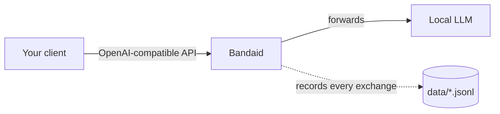
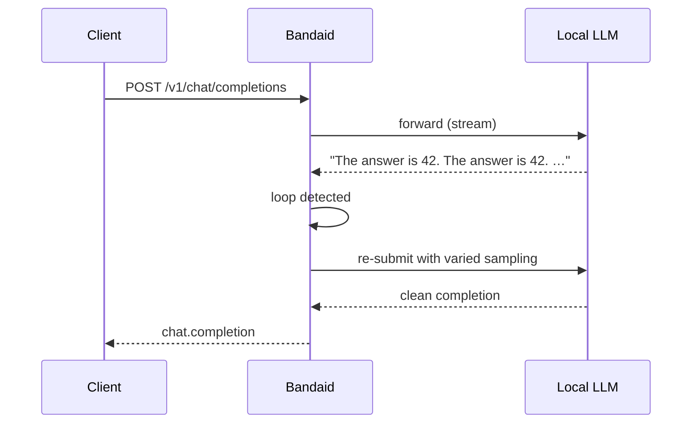

# Bandaid

Bandaid is an HTTP gateway that sits in front of a local LLM (served via an
OpenAI-compatible API) and works around its shortcomings: transient errors
without retries, silently hung or looping models, empty or sloppy responses,
context-window overflows, runaway reasoning, and malformed tool calls. It
records every exchange and remediates what it can before the client ever sees
it.

## Quick start

Bandaid ships as a published container image and runs with Docker Compose.

1. Create your configuration:

   ```bash
   cp .env.example .env
   ```

2. Point `LLM_BASE_URL` in `.env` at your local LLM's OpenAI-compatible
   endpoint (default `http://host.docker.internal:14434`, which reaches a
   host-side LLM on port 14434 from inside the container).

3. Start the gateway:

   ```bash
   docker compose up
   ```

   This runs the published image `ghcr.io/ggeorgovassilis/bandaid:latest`
   (defined in `docker-compose.yml`). To pin a specific release, override the
   tag — for example `ghcr.io/ggeorgovassilis/bandaid:7`.

The gateway listens on `http://localhost:9317` and exposes an
OpenAI-compatible API (e.g. `POST /v1/chat/completions`), forwarding to the
`LLM_BASE_URL` in `.env`.

### File ownership

The container runs as your host user (`UID`/`GID`, default `1000`) so the
files it writes to the bind-mounted `data/` directory are owned by you, not
root. If a `data/` directory was created earlier as root, fix ownership once
before the non-root container can write to it:

```bash
sudo chown -R "$(id -u):$(id -g)" data
```

## Health check

```bash
curl http://localhost:9317/health
```

Returns `{"status": "ok", "upstream": "<LLM_BASE_URL>"}` when the gateway is up.
Operational metrics are exposed at `/metrics` (Prometheus text format, or JSON
with `Accept: application/json`).

## Configuration

Every setting is documented in [`docs/configuration.md`](docs/configuration.md).

## How it works

Bandaid sits between your client and the local LLM, recording every exchange:



When the model misbehaves, bandaid detects it and remediates what it can before
you ever see it — retrying transient failures, nudging empty replies, cleaning
leaked thinking tags, breaking loops with varied sampling:



See [`docs/architecture.md`](docs/architecture.md) for the full design and
[`docs/configuration.md`](docs/configuration.md) for every setting.

## Developing

See [`DEVELOPING.md`](DEVELOPING.md) for local development, running the tests,
and adding a detector or remediation.
