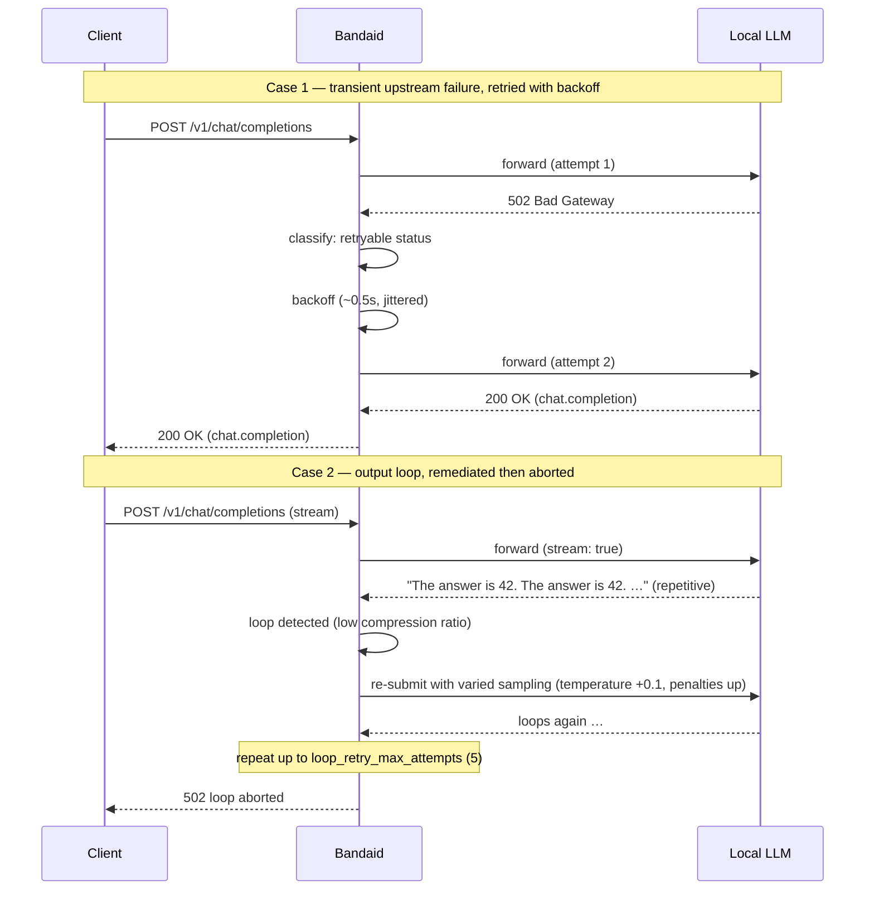

# Remediation examples

Bandaid sits between your client and the local LLM. Every request it forwards
follows the same shape: the gateway forwards the request, *understands* the
failure (or the deficient response), *remediates* what it can, and only then
returns a final response to the client. This page walks through one worked
example per remediation, plus a sequence diagram of the whole interaction.

Each example follows the pattern:

> request → detection → remediation → final response

## Sequence diagram



## Worked examples

### Transient failure retry (exponential backoff)

A dead-or-flaky upstream is the simplest failure: the connection fails, or the
upstream returns a retryable status (`408,429,500,502,503,504`). Bandaid
classifies the failure and retries with exponential backoff, up to
`RETRY_MAX_ATTEMPTS` attempts.

```jsonc
// POST /v1/chat/completions
{ "model": "local", "messages": [{ "role": "user", "content": "Hello" }] }
```

1. **Request** — forwarded to the upstream.
2. **Detection** — attempt 1 raises a connection error (or returns `502`),
   classified as a retryable transient failure.
3. **Remediation** — back off (`0.5s` initial, doubled each attempt, full
   jitter, capped at `30s`) and retry.
4. **Final response** — if a later attempt succeeds, the normal completion is
   returned. If every attempt fails:

```json
{ "error": "upstream failure" }   // 502
```

### Loop detection + varied-sampling retry

A model can get stuck regenerating the same text forever. Bandaid measures the
compression ratio of the last 32 KiB of output: verbatim repetition is very
low entropy, and below a threshold it is declared a loop. A loop is often a
*fixed point* of the sampler, so it is re-submitted with perturbed sampling
rather than retried identically.

1. **Request** — a streaming chat completion.
2. **Detection** — the stream emits `"The answer is 42. The answer is 42. …"`
   over and over; the compression ratio collapses below `0.15` → loop verdict.
3. **Remediation** — re-submit with `temperature` (or `repeat_penalty` /
   `presence_penalty` / `frequency_penalty`) nudged up by `0.1`, or set to
   fallbacks when the client supplied none. Up to `LOOP_RETRY_MAX_ATTEMPTS`
   (5) re-submissions.
4. **Final response** — the varied-sampling re-submission produces a normal
   answer, returned to the client. If it keeps looping, the request is aborted:

```json
{ "error": { "message": "response loop detected", "type": "loop" } }   // 502
```

### Stall detection

A model that returns headers but then goes silent is indistinguishable from a
slow prefill — except by the clock. Bandaid runs a watchdog that resets only
on real content tokens (never on SSE keepalives), with two deadlines:
time-to-first-token and the inter-token gap.

1. **Request** — a streaming chat completion.
2. **Detection** — the upstream returns `200` but no content-bearing token
   arrives within `STALL_TTFT_SECONDS` (120s), or the gap between tokens
   exceeds `STALL_GAP_SECONDS` (60s).
3. **Remediation** — none; a silent model just re-waits, so a stall is aborted
   outright rather than retried.
4. **Final response**:

```json
{ "error": { "message": "upstream stalled", "type": "stalled" } }   // 502
```

### Context-window overflow

When the prompt no longer fits the model's context window, the upstream fails
with a deterministic *message* rather than a distinct status. Retrying cannot
help — the same oversized input fails identically every time — so Bandaid
recognises the signature and fails fast instead of burning retries.

1. **Request** — an oversized prompt.
2. **Detection** — the upstream returns `400` with a body containing
   `"exceeded the context window"` (one of the configured markers).
3. **Remediation** — none; the verdict is non-retryable and carries the
   `context_window_exceeded` code.
4. **Final response** — the upstream's own status and body are forwarded
   verbatim, so the client sees the real error. When no body is available,
   Bandaid synthesises one:

```json
{ "error": { "message": "context window exceeded", "type": "context_window_exceeded" } }   // 413
```

### Think-tag cleanup (placeholder floor)

Reasoning models occasionally leak their chain-of-thought into the visible
`content` field as literal `<think>…</think>` markup — or emit *only* the tag,
producing an empty visible turn. Bandaid relocates the inner text into
`reasoning_content` (never discards it) and guarantees a non-empty reply.

1. **Request** — a streaming chat completion.
2. **Detection** — the assembled completion contains
   `<thinking>Let me work through this…</thinking>` inside `content`.
3. **Remediation** — the inner text is moved to `reasoning_content`, leaving
   `content` empty.
4. **Final response** — because content is empty but reasoning exists, the
   placeholder floor is applied:

```json
{
  "content": "The model replied inside a thinking tag; see reasoning_content.",
  "reasoning_content": "Let me work through this…"
}
```

### Nudge (empty-turn re-prompt)

Some models finish a turn with `finish_reason: stop`, no visible content, no
tool calls — but non-empty reasoning. Retrying the identical request reproduces
the same empty turn; re-submitting with an appended instruction gives the model
a second chance to surface an answer.

1. **Request** — a streaming chat completion.
2. **Detection** — the turn stops with empty `content`, empty `tool_calls`, and
   non-empty `reasoning_content`.
3. **Remediation** — re-submit with a `user` message appended
   ("…reply with a visible answer, or call a tool…"), up to
   `THINK_NUDGE_MAX_ATTEMPTS` (2) times.
4. **Final response** — a later attempt produces real content, returned to the
   client. If the budget is exhausted, the placeholder floor (above) is used.

### Coast detection

Mid-way through a multi-step tool loop, a model sometimes ends a turn with
visible content but *no* tool call, even though a tool call was possible and
the model's reasoning collapsed to be byte-identical with its visible text. The
model "coasted" — it regurgitated its status line instead of acting.

1. **Request** — a chat completion carrying a `tools` list, with a prior
   assistant tool-call turn already in the conversation.
2. **Detection** — the turn stops with non-empty `content`
   (`"Chunk 5 done… pulling next chunk."`), no `tool_calls`, and
   `reasoning == content` exactly.
3. **Remediation** — replay the coasted assistant turn and append a re-prompt
   ("…call the tool now…"), up to `COAST_MAX_ATTEMPTS` (2) times.
4. **Final response** — the model emits the tool call on a later attempt. If it
   keeps coasting, the coasted turn is returned as-is (visible content, no
   crash).

### Runaway-reasoning detection

Some models think *endlessly*: reasoning tokens keep flowing while content
stays at zero. This is invisible to the loop detector (the reasoning is
high-entropy, not repetitive) and to the stall watchdog (tokens are flowing).
Bandaid watches the reasoning stream for the invariant "reasoning keeps
flowing, content stays zero".

1. **Request** — a streaming chat completion.
2. **Detection** — reasoning tokens exceed `RUNAWAY_REASONING_TOKEN_THRESHOLD`
   (2000) with no content yet, or the output window is exhausted
   (`finish_reason: length`) with reasoning but no content.
3. **Remediation** — re-submit with a stop-thinking nudge ("…stop thinking and
   produce your final answer now…"), up to `RUNAWAY_REASONING_MAX_ATTEMPTS`
   (2) times.
4. **Final response** — a later attempt answers. If every re-submission runs
   away too, the request is aborted:

```json
{ "error": { "message": "runaway reasoning", "type": "runaway_reasoning" } }   // 502
```

### Message overflow

A single `role: "tool"` result can be arbitrarily large, silently eating the
model's context window. Bandaid rewrites oversized tool results *before*
forwarding the request upstream.

1. **Request** — a chat completion whose `messages` include a `role: "tool"`
   message larger than `MESSAGE_OVERFLOW_THRESHOLD` (4096 characters).
2. **Detection** — a pure size comparison on the tool-result content.
3. **Remediation** — prepend a warning and truncate the result to a bounded
   prefix (first line, capped at the threshold). `user`/`system`/`assistant`
   content is never touched.
4. **Final response** — the rewritten body is forwarded upstream; the client
   receives whatever the model produces with the reclaimed context.

### Tool-call syntax enforcement

Local models sometimes emit malformed or truncated tool calls — unbalanced
braces, a cut-off `function.arguments`, a stray trailing comma. Bandaid
validates each assembled call, repairs deterministic breakage, and flags the
rest without crashing the request.

1. **Request** — a chat completion that produces a tool call.
2. **Detection** — `function.arguments` is not valid JSON.
3. **Remediation** — deterministic truncation is repaired by closing open
   strings/containers, e.g. `{"query": "hello"` → `{"query": "hello"}`. A
   mangled structure (missing `function`/`name`) is left in place and flagged.
4. **Final response** — the (possibly repaired) tool call is returned to the
   client, with every mutation recorded.
